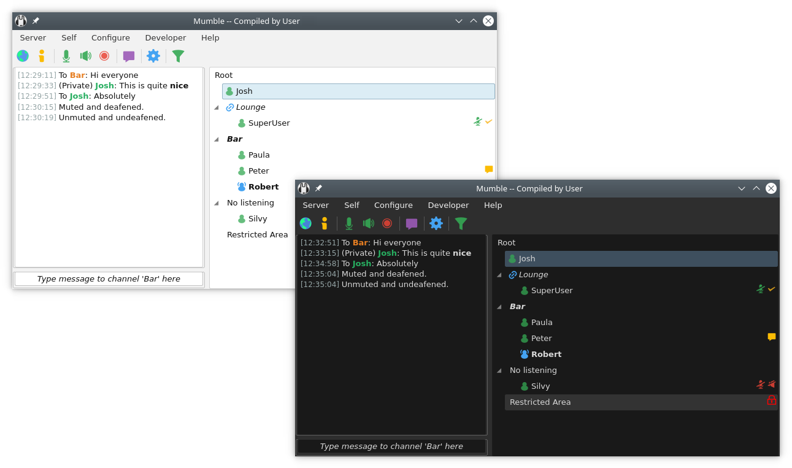

# Mumble - macOS client

A macOS-focused fork of [Mumble](https://www.mumble.info), the Open
Source, low-latency, high-quality voice-chat program built on Qt and
Opus. This fork narrows the upstream tree to a single target — a
macOS-native client — and drops the server, overlay, Windows/Linux
backends, and related CI that do not apply.

Upstream documentation still applies to the Mumble client in general
and can be found on [mumble.info](https://www.mumble.info/documentation/).

## Contributing

Contributions are welcome. If you have a change in mind, open a PR
against `main`. Please follow the [commit guidelines](COMMIT_GUIDELINES.md).

If you are new to the Mumble source tree, the [introduction to the
Mumble source code](docs/dev/TheMumbleSourceCode.md) is a useful
starting point.

### Translating

Translations are inherited from upstream Mumble, which uses Weblate.
[Register on Weblate](https://hosted.weblate.org/accounts/register/)
and join [the upstream translation project](https://hosted.weblate.org/projects/mumble/)
to contribute there.

### Writing plugins

Mumble's general-purpose plugin ABI is inherited from upstream; see the
[plugin documentation](docs/dev/plugins/README.md) for how to build one.

## Building

See the [build instructions](docs/dev/build-instructions/README.md).

## Reporting issues

Open a new issue on [this fork's tracker](https://github.com/nicholas-lonsinger/mumble-macos/issues).
For upstream Mumble bugs that also reproduce here, cross-link to
[mumble-voip/mumble](https://github.com/mumble-voip/mumble/issues).

## Running Mumble on macOS

Drag the built `Mumble.app` into your `/Applications` folder.
